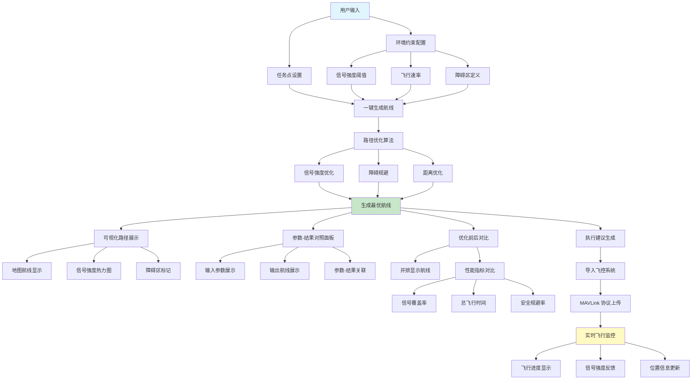
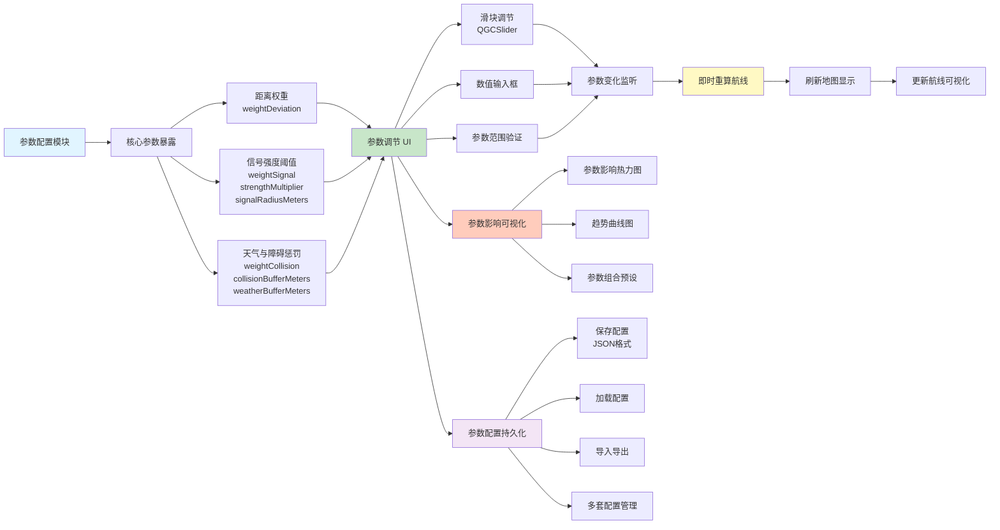
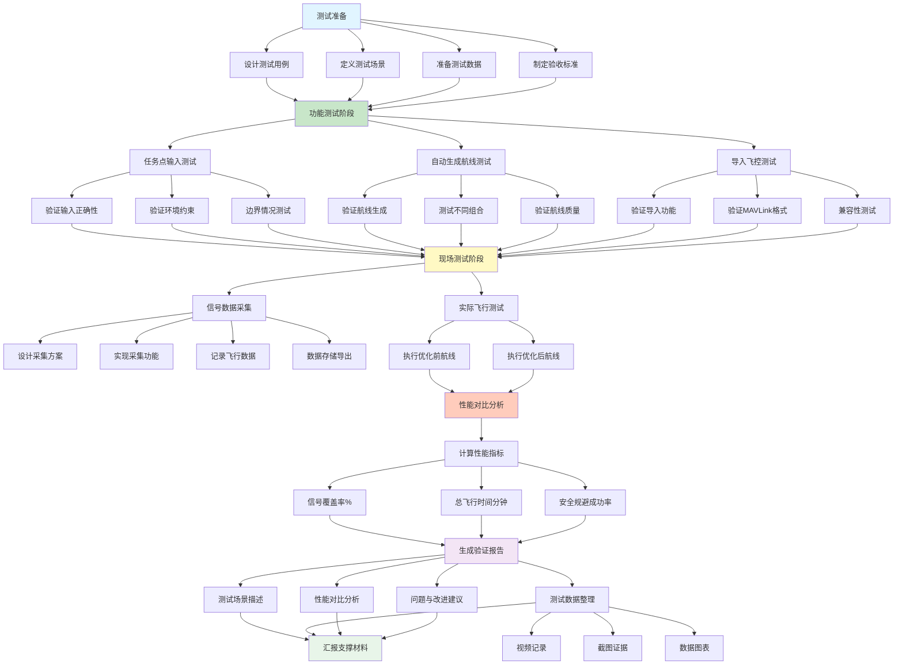

Todo List

## 1. 平台架构升级

### 1.1 明确平台定位
- [x] 定义用户输入（任务点 + 环境约束：信号强度、速率、**障碍区**等）
- [x] 定义系统输出（最优航线 + 可视化路径 + **执行建议**）

### 1.2 构建完整闭环流程
- [x] 实现一键生成航线功能：支持从任务点自动生成优化航线
- [x] 实现航线导入飞控功能：集成 MAVLink 协议，支持将生成的航线直接上传到飞控系统
- [x] 实现实时飞行状态反馈：在 UI 中显示飞行进度、信号强度、位置等实时数据

### 1.3 参数-结果对照面板
- [ ] **创建独立 UI 组件，清晰展示用户输入参数**（任务点、信号阈值、障碍区等）
- [ ] **展示系统输出航线与输入参数的对应关系**
- [ ] 支持参数修改后的实时更新显示

### 1.4 优化前后对比功能
- [ ] 开发**对比视图**，支持并排显示优化前后的航线
- [ ] **展示算法改进对航线质量的影响**：
  - **信号覆盖率**（%）
  - **总飞行时间**（分钟）
  - **安全规避成功率**（如避开障碍区次数）

### 1.5 可视化增强
- [x] 完善地图上的航线可视化
- [x] 实现信号强度热力图显示
- [x] 添加障碍区标记和可视化

---

## 2. 算法与参数透明化

### 2.1 暴露核心参数

#### 2.1.1 **距离权重**（Distance Weight）
- [ ] 在 `TowerOptimizer` 中确保 `weightDeviation` 参数可配置
- [ ] 在 UI 中暴露该参数，支持用户调节
- [ ] 添加参数说明文档

#### 2.1.2 **信号强度阈值**（Signal Power Threshold）
- [ ] 暴露信号强度相关参数：
  - `weightSignal`（信号权重）
  - `strengthMultiplier`（强度倍数）
  - `signalRadiusMeters`（信号半径）
- [ ] 在 UI 中提供参数配置界面
- [ ] 添加参数说明文档

#### 2.1.3 **天气与障碍惩罚项**（Weather/Obstacle Penalty）
- [ ] 暴露碰撞检测相关参数：
  - `weightCollision`（碰撞权重）
  - `collisionBufferMeters`（碰撞缓冲区）
  - `weatherBufferMeters`（天气缓冲区）
- [ ] 在 UI 中提供参数配置界面
- [ ] 添加参数说明文档

### 2.2 开发参数调节 UI 模块
- [ ] 在 `PlanView` 中创建参数调节面板
- [ ] 使用 `QGCSlider` 组件实现滑块调节功能
- [ ] 支持数值输入框直接输入
- [ ] 实现参数范围验证和提示

### 2.3 参数影响可视化
- [ ] 创建参数影响热力图：展示不同参数组合对航线长度、覆盖质量的影响
- [ ] 或实现趋势曲线：展示参数变化对性能指标的影响趋势
- [ ] 支持参数组合预设（快速切换常用配置）

### 2.4 参数配置持久化
- [ ] 实现参数配置的保存功能（JSON 格式）
- [ ] 实现参数配置的加载功能
- [ ] 支持配置文件导入导出
- [ ] 支持多套配置方案管理

---

## 3. 使用者视角测试

### 3.1 设计全流程测试用例
- [ ] 编写测试脚本，覆盖从输入任务点到实际飞行的完整流程
- [ ] 定义测试场景和测试数据
- [ ] 制定测试验收标准

### 3.2 功能测试

#### 3.2.1 任务点输入测试
- [ ] 验证用户输入任务点的功能正确性
- [ ] 验证环境约束输入（信号强度、速率、障碍区）的功能正确性
- [ ] 测试边界情况和异常输入处理

#### 3.2.2 自动生成航线测试
- [ ] 验证系统能够根据输入自动生成优化航线的功能
- [ ] 测试不同任务点组合的航线生成
- [ ] 验证航线质量（覆盖率、安全性等）

#### 3.2.3 导入飞控测试
- [ ] 验证航线能够正确导入飞控系统
- [ ] 验证格式符合 MAVLink 协议要求
- [ ] 测试与不同飞控系统的兼容性

### 3.3 现场数据采集
- [ ] 设计信号强度数据采集方案
- [ ] 实现数据采集功能（使用手机或其他终端）
- [ ] 记录飞行全程信号覆盖变化
- [ ] 实现数据存储和导出功能

### 3.4 性能对比测试
- [ ] 设计优化前后对比测试方案
- [ ] 对比指标：
  - 信号覆盖率（%）
  - 总飞行时间（分钟）
  - 安全规避成功率（避开障碍区次数）
- [ ] 收集测试数据并生成对比报告

