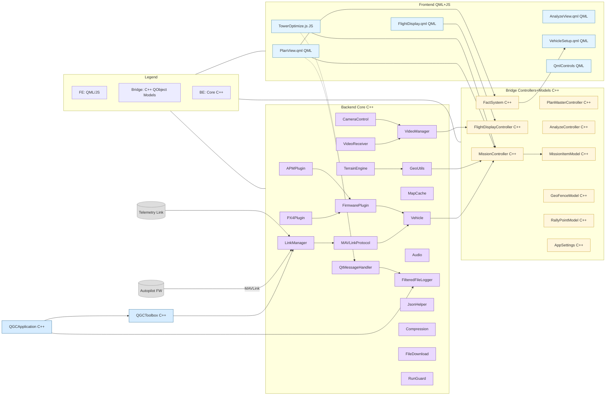
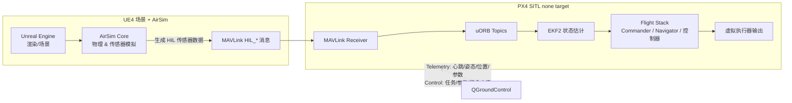
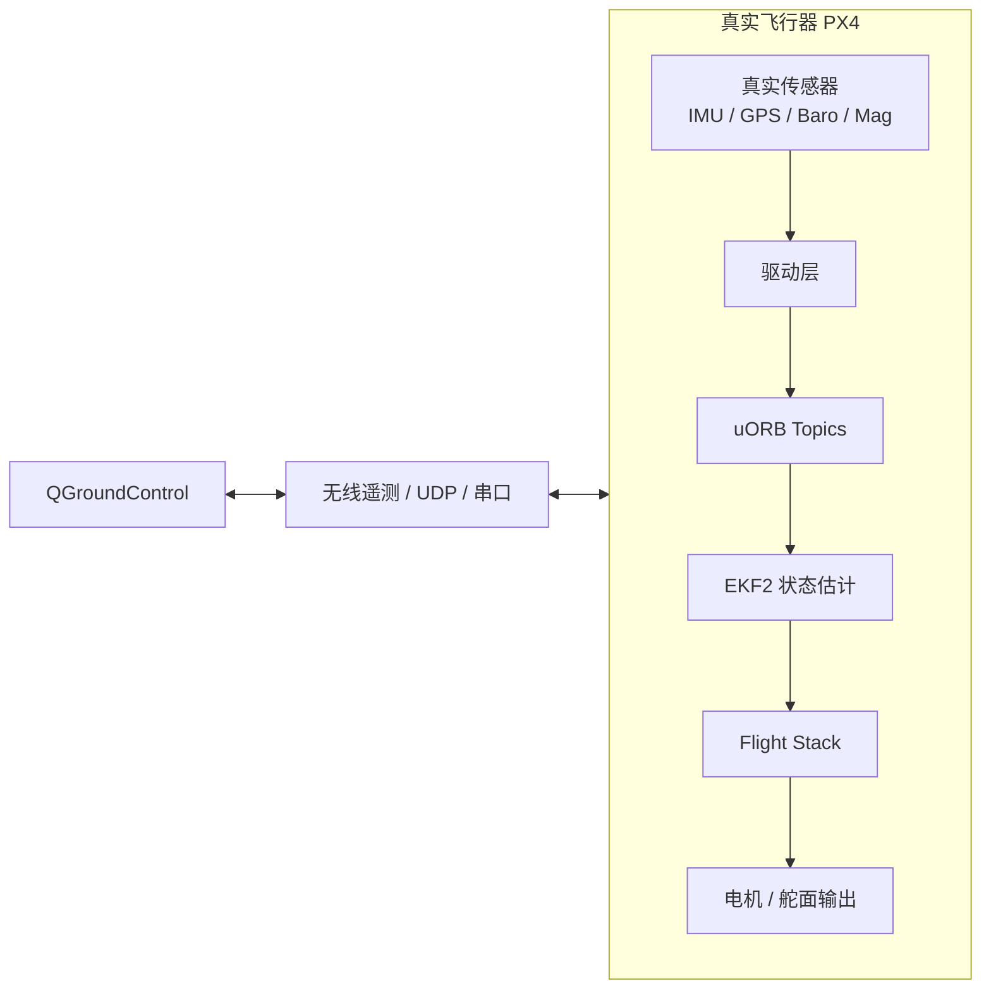
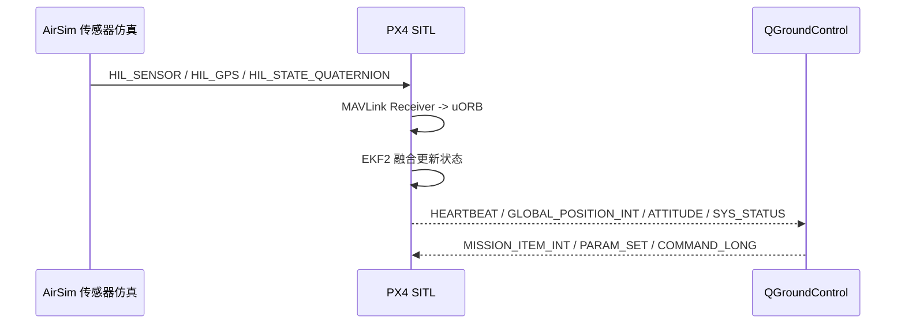
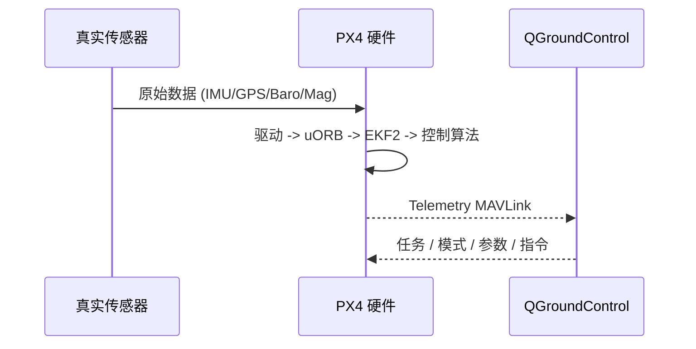

# QGC code review

## 1. compile

### 编译QGC
```shell
cmake --build build -j"$(nproc)"
```

### 交叉编译 AppImage
```shell
bash deploy/create_linux_appimage.sh . build deploy
```

## 2. code introduction




入口与核心框架
- main.cc: 应用入口，初始化 QGCApplication 并启动 QML/UI。
- QGCApplication.{cc,h}: 应用生命周期与全局初始化，创建 QGCToolbox，注册 C++/QML 类型，装载资源等。
- QGCToolbox.{cc,h}: 服务容器，集中持有并初始化各子系统（通信、参数、任务、地图、视频、设置等）。
- QGC.{cc,h}: 全局常量/工具，应用级别的辅助逻辑。
- stable_headers.h: 统一包含，稳定化编译头。

通信与设备
- comm: 通信层（MAVLink/链路管理、串口/UDP/TCP 等）。
- Vehicle: 车辆模型，MAVLink 状态与命令的核心数据对象。
- FirmwarePlugin: 针对不同固件（PX4/ArduPilot）定制行为/能力抽象。
- AutoPilotPlugins: 自动驾驶插件（参数/设置面板、校准流程等 UI/逻辑）。
- Joystick: 遥控器/手柄输入支持。
- GPS: GPS 设备支持。
- ADSB: 空域感知（ADS-B）支持。
- Gimbal: 云台控制。
- Microhard / Taisync: 特定视频/数传链路厂商集成。

任务/规划/地图
- MissionManager: 任务/航线管理（上传/下载/编辑）。
- PlanView: 任务规划界面及逻辑。
- FlightMap / FlightDisplay: 飞行地图与飞行视图（基于 Qt Location/QML）。
- Terrain / TerrainTile.{cc,h}: 地形数据下载与缓存。
- Geo: 地理工具与坐标变换。
- KMLDomDocument/KMLHelper、SHPFileHelper/ShapeFileHelper: KML/SHP 文件解析与导入导出。
- QtLocationPlugin: 自定义/扩展 Qt Location 插件胶水层。

参数/配置/数据
- FactSystem: 参数/设置的模型系统（Fact/FactMeta，用于参数绑定与校验）。
- Settings: 应用设置与持久化。
- QGCMapPalette/QGCPalette/QGCMapPalette: 主题与配色。
- QGCQGeoCoordinate: 封装经纬度坐标的工具类。
- QGCTemporaryFile/QGCCachedFileDownload/QGCFileDownload: 文件缓存/下载辅助。

音视频与多媒体
- VideoManager: 视频通道整体调度（摄像头/流地址、GStreamer 初始化等）。
- VideoReceiver: 具体视频接收实现（GStreamer 管道等）。
- Audio: 语音播报、音效（依赖 TextToSpeech/GStreamer）。
- Camera: 相机控制相关抽象与 UI。

应用界面与控件
- QmlControls: 自定义 QML 组件库（UI 基础控件）。
- VehicleSetup: 设备设置/校准向导界面。
- AnalyzeView: 日志/分析工具视图。
- FirstRunPromptDialogs: 首次运行提示/引导。
- PairingManager, FollowMe, MobileScreenMgr: 设备配对、跟随模式、移动端屏幕适配等。
- ui: 额外的 UI 辅助组件与桥接。

工具与通用组件
- Compression: 压缩/解压工具。
- JsonHelper: JSON 读写校验工具。
- LogCompressor: 飞行日志压缩。
- RunGuard: 单实例运行守卫。
- api: 对外 API/封装（如与脚本或外部模块交互）。

单元测试与文档
- qgcunittest: 单元测试集合。
- documentation.dox: Doxygen 文档入口。

资源与构建
- CMakeLists.txt: 目标 QGroundControl 可执行程序，链接子库 qgc；聚合资源 QRC：
  - qgcimages.qrc, qgcresources.qrc, qgroundcontrol.qrc
  - Firmware 插件资源：APMResources.qrc, PX4Resources.qrc
  - UI 图标：resources/InstrumentValueIcons/…
  - VideoReceiverApp/qml.qrc（视频相关 QML）
- 与 GStreamer、Qt5 各模块强依赖（Charts/Location/Multimedia/Positioning/Quick/Widgets/TTS/WebEngine 等）。

建议阅读顺序
1) main.cc → QGCApplication → QGCToolbox（掌握生命周期与模块装配）
2) Vehicle/comm/FirmwarePlugin/AutoPilotPlugins（通信与设备模型）
3) MissionManager/PlanView/FlightMap/FlightDisplay（任务与地图 UI）
4) FactSystem/Settings（参数与配置绑定）
5) VideoManager/VideoReceiver（视频链路）


# PX4 + AirSim + UE4 + QGroundControl 与 实机架构示意

## 1. 仿真链路 (UE4 + AirSim + PX4 SITL + QGC)



## 2. 实机链路 (真实 PX4 硬件 + QGC)



## 3. 仿真时序 (AirSim -> PX4 SITL -> QGC)



## 4. 实机时序 (Real Sensors -> PX4 -> QGC)



## 5. 关键差异
- 仿真传感器由 AirSim 产生 HIL_*；实机为真实硬件
- Home 判定：仿真=OriginGeopoint；实机=首次有效 GPS Fix
- 输出：仿真虚拟执行；实机驱动真实电机
