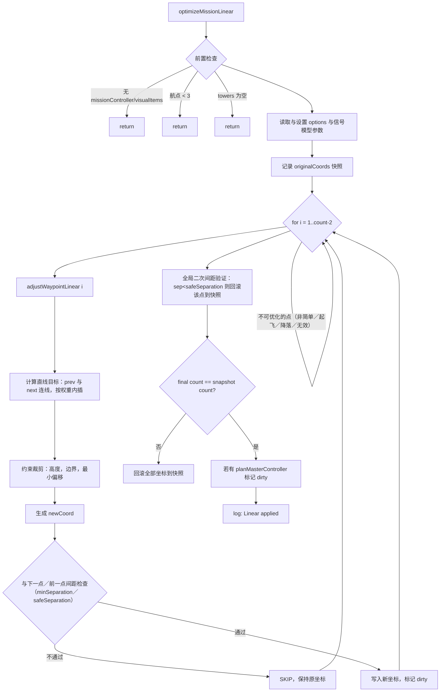
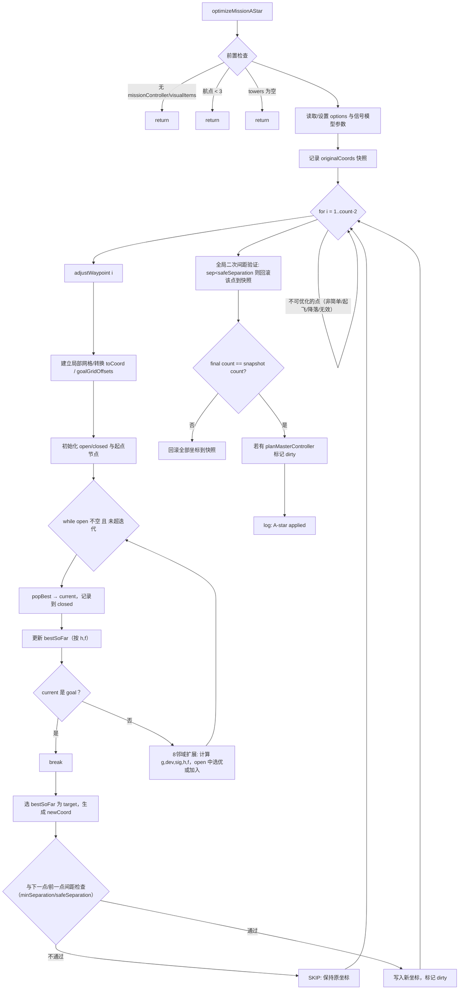
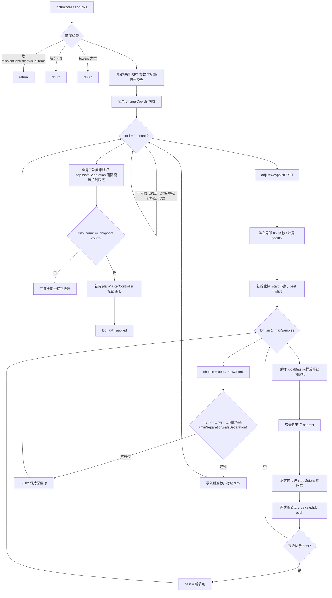

# optimizeMissionLinear

```mermaid
graph TD
    A[optimizeMissionLinear] --> B{前置检查};
    B -->|"无 missionController/visualItems"| Z1[return];
    B -->|"航点 &lt; 3"| Z2[return];
    B -->|"towers 为空"| Z3[return];
    B --> C[读取与设置 options 与信号模型参数];
    C --> D[记录 originalCoords 快照];
    D --> E{for i = 1..count-2};
    E -->|"不可优化的点（非简单／起飞／降落／无效）"| E;
    E --> F[adjustWaypointLinear i];
    F --> G[计算直线目标：prev 与 next 连线，按权重内插];
    G --> H[约束裁剪：高度，边界，最小偏移];
    H --> I[生成 newCoord];
    I --> J{与下一点／前一点间距检查（minSeparation／safeSeparation）};
    J -->|"不通过"| K[SKIP，保持原坐标];
    J -->|"通过"| L[写入新坐标，标记 dirty];
    L --> E;
    K --> E;
    E --> M[全局二次间距验证：sep&lt;safeSeparation 则回滚该点到快照];
    M --> N{final count == snapshot count?};
    N -->|"否"| O[回滚全部坐标到快照];
    N -->|"是"| P[若有 planMasterController 标记 dirty];
    P --> Q[log: Linear applied];
```

# optimizeMissionAStar

```mermaid
graph TD
    A[optimizeMissionAStar] --> B{前置检查};
    B -->|"无 missionController/visualItems"| Z1[return];
    B -->|"航点 &lt; 3"| Z2[return];
    B -->|"towers 为空"| Z3[return];
    B --> C[读取/设置 options 与信号模型参数];
    C --> D[记录 originalCoords 快照];
    D --> E{for i = 1..count-2};
    E -->|"不可优化的点（非简单/起飞/降落/无效）"| E;
    E --> F[adjustWaypoint i];
    F --> G[建立局部网格/转换 toCoord / goalGridOffsets];
    G --> H[初始化 open/closed 与起点节点];
    H --> I{while open 不空 且 未超迭代};
    I --> J[popBest → current，记录到 closed];
    J --> K[更新 bestSoFar（按 h,f）];
    K --> L{current 是 goal？};
    L -->|"是"| M[break];
    L -->|"否"| N[8邻域扩展: 计算 g,dev,sig,h,f，open 中选优或加入];
    N --> I;
    M --> O[选 bestSoFar 为 target，生成 newCoord];
    O --> P{与下一点/前一点间距检查（minSeparation/safeSeparation）};
    P -->|"不通过"| Q[SKIP: 保持原坐标];
    P -->|"通过"| R[写入新坐标，标记 dirty];
    R --> E;
    Q --> E;
    E --> S[全局二次间距验证: sep&lt;safeSeparation 则回滚该点到快照];
    S --> T{final count == snapshot count?};
    T -->|"否"| U[回滚全部坐标到快照];
    T -->|"是"| V[若有 planMasterController 标记 dirty];
    V --> W[log: A-star applied];
```
# # optimizeMissionRRT

```mermaid
graph TD
    A[optimizeMissionRRT] --> B{前置检查};
    B -->|"无 missionController/visualItems"| Z1[return];
    B -->|"航点 &lt; 3"| Z2[return];
    B -->|"towers 为空"| Z3[return];
    B --> C[读取/设置 RRT 参数与权重/信号模型];
    C --> D[记录 originalCoords 快照];
    D --> E{for i = 1..count-2};
    E -->|"不可优化的点（非简单/起飞/降落/无效）"| E;
    E --> F[adjustWaypointRRT i];
    F --> G[建立局部 XY 坐标 / 计算 goalXY];
    G --> H[初始化树: start 节点，best = start];
    H --> I{for it in 1..maxSamples};
    I --> J[采样: goalBias 采样或半径内随机];
    J --> K[查最近节点 nearest];
    K --> L[沿方向步进 stepMeters 并限幅];
    L --> M[评估新节点 g,dev,sig,h,f，push];
    M --> N{是否优于 best?};
    N -->|"是"| O[best = 新节点];
    N -->|"否"| I;
    O --> I;
    I --> P[chosen = best，newCoord];
    P --> Q{与下一点/前一点间距检查（minSeparation/safeSeparation）};
    Q -->|"不通过"| R[SKIP: 保持原坐标];
    Q -->|"通过"| S[写入新坐标，标记 dirty];
    S --> E;
    R --> E;
    E --> T[全局二次间距验证: sep&lt;safeSeparation 则回滚该点到快照];
    T --> U{final count == snapshot count?};
    U -->|"否"| V[回滚全部坐标到快照];
    U -->|"是"| W[若有 planMasterController 标记 dirty];
    W --> X[log: RRT applied];
```