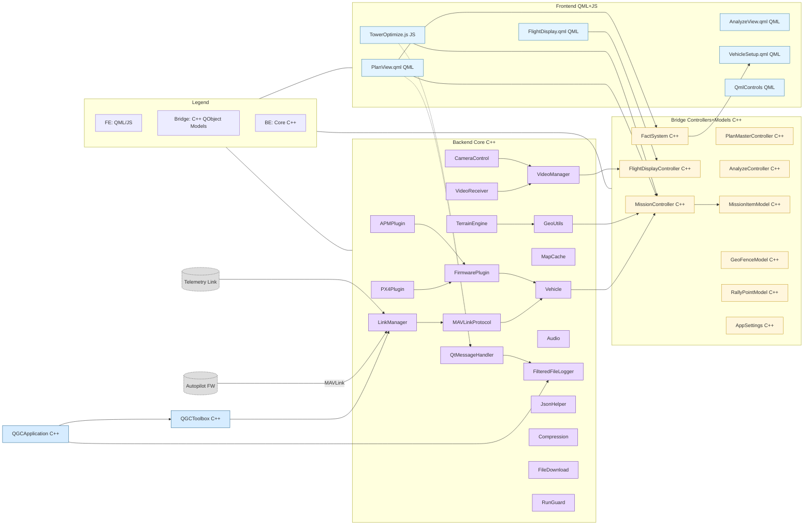
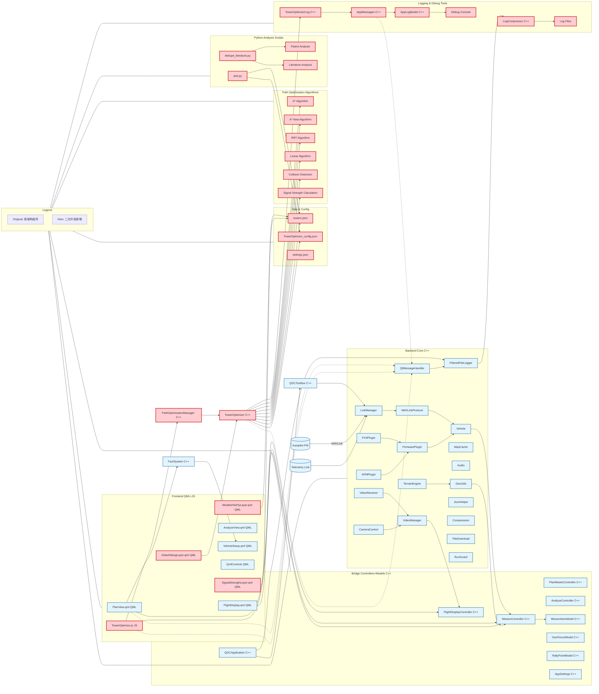
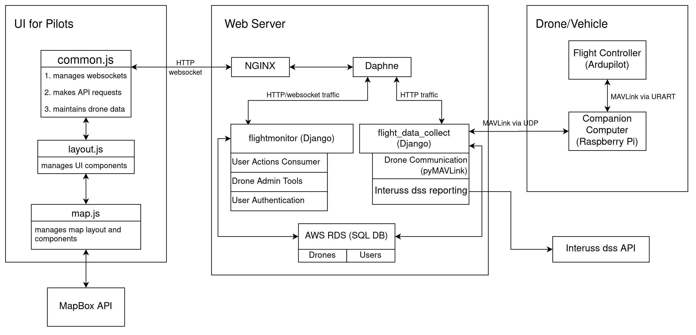
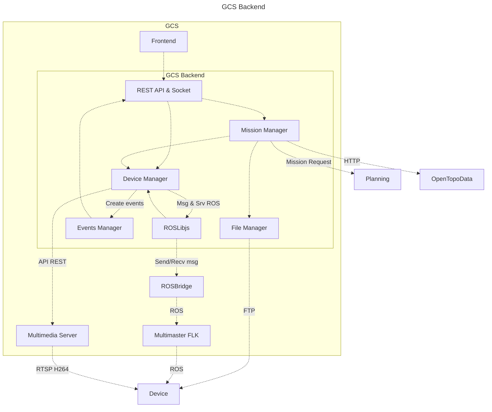

# Release note

## C/S 架构

### 原始架构

**无人机平台Qt Application架构**

#### 1. 入口与核心框架
- 顶层设计Qt Application(C/S架构)
- Backend Core C++: 系统层，协议层
- Bridge Controllers&Models: 无人机控制层
- Frontend QML&JS：前端Qt组件和JS脚本

#### 2. 通信与设备
- **comm**: 通信层（MAVLink/链路管理、串口/UDP/TCP 等）。
- **Vehicle**: 无人机模型，MAVLink 状态与命令的核心数据对象。
- **FirmwarePlugin**: 针对不同固件（PX4/ArduPilot）定制行为/能力抽象。
- **AutoPilotPlugins**: 自动驾驶插件（参数/设置面板、校准流程等 UI/逻辑）。
- Joystick: 遥控器/手柄输入支持。
- GPS: GPS 设备支持。
- ADSB: 空域感知（ADS-B）支持。
- Gimbal: 云台控制。
- Microhard / Taisync: 特定视频/数传链路厂商集成。

#### 3. 任务/规划/地图
- **MissionManager**: 任务/航线管理（上传/下载/编辑）。
- **PlanView**: 任务规划界面及逻辑。
- **FlightMap / FlightDisplay**: 飞行地图与飞行视图（基于 Qt Location/QML）。
- **Terrain** / TerrainTile.{cc,h}: 地形数据下载与缓存。
- **Geo**: 地理工具与坐标变换。
- KMLDomDocument/KMLHelper、SHPFileHelper/ShapeFileHelper: KML/SHP 文件解析与导入导出。
- QtLocationPlugin: 自定义/扩展 Qt Location 插件胶水层。

#### 4.参数/配置/数据
- FactSystem: 参数/设置的模型系统（Fact/FactMeta，用于参数绑定与校验）。
- Settings: 应用设置与持久化。
- QGCMapPalette/QGCPalette/QGCMapPalette: 主题与配色。
- QGCQGeoCoordinate: 封装经纬度坐标的工具类。
- QGCTemporaryFile/QGCCachedFileDownload/QGCFileDownload: 文件缓存/下载辅助。

#### 5. 音视频与多媒体
- VideoManager: 视频通道整体调度（摄像头/流地址、GStreamer 初始化等）。
- VideoReceiver: 具体视频接收实现（GStreamer 管道等）。
- Audio: 语音播报、音效（依赖 TextToSpeech/GStreamer）。
- Camera: 相机控制相关抽象与 UI。

#### 6. 应用界面与控件
- **QmlControls**: 自定义 QML 组件库（UI 基础控件）。
- **VehicleSetup**: 设备设置/校准向导界面。
- **AnalyzeView**: 日志/分析工具视图。
- FirstRunPromptDialogs: 首次运行提示/引导。
- PairingManager, FollowMe, MobileScreenMgr: 设备配对、跟随模式、移动端屏幕适配等。
- ui: 额外的 UI 辅助组件与桥接。

#### 7. 工具与通用组件
- Compression: 压缩/解压工具。
- JsonHelper: JSON 读写校验工具。
- LogCompressor: 飞行日志压缩。
- RunGuard: 单实例运行守卫。
- api: 对外 API/封装（如与脚本或外部模块交互）。

#### 8. 单元测试与文档
- qgcunittest: 单元测试集合。
- documentation.dox: Doxygen 文档入口。

#### 9. 资源与构建
**- CMakeLists.txt: 目标 QGroundControl 可执行程序，链接子库 qgc**；聚合资源 QRC：
  - qgcimages.qrc, qgcresources.qrc, qgroundcontrol.qrc
  - Firmware 插件资源：APMResources.qrc, PX4Resources.qrc
  - UI 图标：resources/InstrumentValueIcons/…
  - VideoReceiverApp/qml.qrc（视频相关 QML）
- 与 GStreamer、Qt5 各模块强依赖（Charts/Location/Multimedia/Positioning/Quick/Widgets/TTS/WebEngine 等）。

> QGroundControl 是 Apache 2.0 和 GPLv3 双重许可

### 二次开发后架构

 

### 二次开发主要功能

#### 1. 智能路径优化算法 （后端）
- **A*算法**: 经典网格化路径搜索，支持多目标优化
- **A*New算法**: 50米固定步长优化版本，提升搜索效率
- **RRT算法**: 快速探索随机树，适应复杂环境
- **线性算法**: 简单快速的线性优化方法
- **碰撞检测**: 地形、气象、禁飞区多重安全检测
- **信号强度计算**: 基于基站距离的通信质量评估

#### 2. 可视化图层系统 （前端）
- **WeatherNoFlyLayer**: 气象禁飞区可视化，支持向上/向下禁飞
- **SignalStrengthLayer**: 基站信号强度热力图显示
- **AStarDebugLayer**: A*算法搜索过程实时可视化调试

#### 3. 数据配置管理 （数据库）
- **towers.json**: 基站和传感器位置数据管理
- **TowerOptimize_config.json**: 算法参数配置文件

#### 4. 日志调试系统 （日志）
- **TowerOptimizerLog**: 路径优化算法专用日志分类
- **多级日志**: Debug/Warning/Critical分级记录

#### 5. Python分析工具 （分析工具）
- **plot.py**: 日志算法数据可视化，开发用
- **dedupe_literature.py**: 学术文献分析工具

## B/S 架构

- https://github.com/CloudStationTeam/cloud_station_web

- https://arpoma16.github.io/multiuav_gui_doc/#/

### 案例1. **DroneDeploy（大疆）**
https://www.dronedeploy.com/product/dronedeploy-aerial

- **服务**：商业云端无人机作业平台
  - 数据自动上传至云端服务器
  - 用户通过浏览器访问地图、3D 模型、AI 分析报告
  - 聚焦农业、建筑、能源行业的数据处理
  - 支持团队协作、历史任务对比、自动报告生成
  - 飞行控制仍依赖移动端 App，但任务管理与分析为 B/S 模式

### 案例2. **Skydio Cloud（美国）**
https://www.skydio.com/software/remote-ops

- **DFR 命令**：远程启动和调度无人机任务（DFR，主动响应者无人机计划）。
- **远程作业与巡检**：支持通过浏览器远程操作无人机，进行自动巡检等任务。
- **3D/2D 建模与数据同步**：无人机现场采集模型，数据可实时同步至云端。
- **实时视频直播**：无人机画面支持网页和移动端实时流媒体观看。
- **远程驾驶舱**：Web 页面即可远程操控，减少现场需求。
- **车队和任务管理**：集中管理设备、飞手和飞行活动，支持大规模无人机调度。
- **开放接口**：提供 REST API、WebSocket，便于与第三方系统集成。

### 案例3. **Auterion Suite（美国）**
  - 飞控：基于 PX4 的 Skynode（企业级）
  - 地面端：Mission Control（提供桌面版 + Web 版）
  - 远程任务监控、机队管理、遥测可视化
  - 面向企业级用户，与企业 IT 系统集成（如 ERP、工单系统）
  - Web 端侧重管理，底层控制仍依赖 C/S 客户端

### 总结
- 现代无人机系统常采用 **混合架构**：底层飞控通信使用 C/S 模式保障实时性，上层任务管理与数据分析采用 B/S 模式提升可访问性。
- PolyU C/S 平台：赋能铁塔结合自身资源的无人机管理和控制能力，输出无人机标准格式信息
- *天津科创中心* B/S：数据Web Server，负责空域数据存储和分析，实时读取和显示无人机信息（或**提供数据上传API**）。
- 长期策略：
  - 无人机控制Server和数据Server合并
  - 前端客户端统一Web架构
  - 用户能通过浏览器和互联网直接访问服务器，管理无人机，分析数据

根据你提供的 `git log` 输出（截至 **2025年11月18日**），近期开发工作可总结为以下三大方向：

---

### **1. Linux 部署流程自动化与 AppImage 优化**
- 新增 `deploy_appimage.sh` 脚本，实现 QGroundControl 的**一键构建与打包为 AppImage**，提升跨发行版部署效率。
- 更新 `create_linux_appimage.sh`：
  - 启用 `--appimage-extract-and-run` 标志，**绕过 FUSE 依赖**，兼容更多系统环境（尤其无 root 权限场景）。
- 完善部署文档，并通过 `.gitignore` 排除临时部署产物，保持仓库整洁。

---

### **2. 路径规划算法优化**
根据坪山实地实验经验改进算法。
- **A* 算法改进**：
  - 调整航向候选角度偏移量（从 45° → 35°），提升路径搜索**精度与平滑性**（见 commit `584258f`）。
  - 引入动态参数调整机制，适配不同任务场景。
- **RRT（快速扩展随机树）算法增强**：
  - 优化采样策略与扩展逻辑，提升复杂环境下的收敛速度与可行性。
- **通用路径优化**：
  - 改进航点生成逻辑：**防止航点过度聚集**，确保航点间距符合安全/任务比例约束（如最小转弯半径、传感器视场覆盖等）。

---

### **3. 场景拓展：新增塔台配置与空域管理**
- 在 `towers.json` 中新增 **Tower4 与 Tower5**，完善地理坐标与类型定义。
- 统一调整各塔台传感器的**禁飞半径**，提升空域约束一致性与安全性。
- 支持更复杂的多塔协同任务仿真/部署。

---

### 文档与可维护性提升
- 补充详细的 **Release Notes（Markdown）**，涵盖 A* 升级、碰撞检测改进、可视化组件增强等。
- 新增架构示意图（binary file），辅助理解系统变更。
- 整理临时笔记与脚本，提升项目可追溯性。

